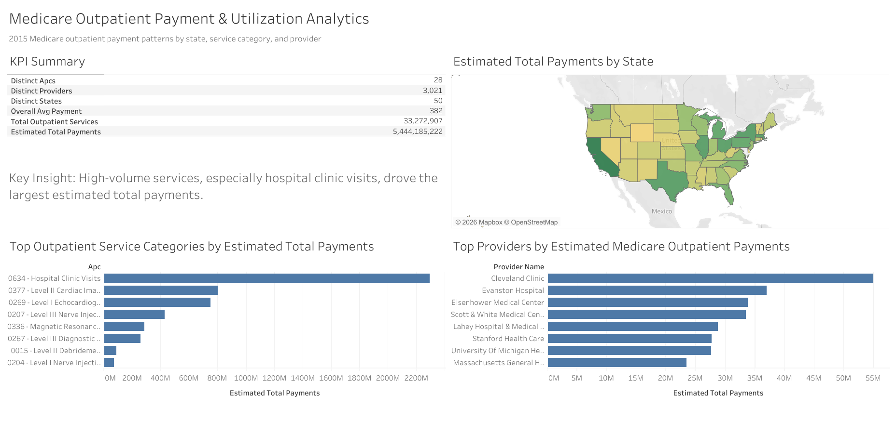

# Medicare Outpatient Payment & Utilization Analytics

## Project Overview

This project analyzes 2015 Medicare outpatient payment and utilization data using Google BigQuery and Tableau Public. The goal was to identify geographic, procedure-level, and provider-level patterns in outpatient Medicare payments and understand whether total payment impact was driven more by average payment amounts or service volume.

This project was completed as a real-world healthcare analytics case study using a public dataset.

## Business Problem

Healthcare organizations, analysts, and policymakers need to understand where outpatient payment impact is concentrated and what factors drive overall spending patterns.

This analysis explores the following questions:

* Which states had the highest average outpatient Medicare payments?
* Which states had the highest estimated total outpatient payments?
* Which outpatient service categories had the highest average payments?
* Which outpatient service categories had the highest estimated total payments?
* Which providers had the highest estimated outpatient payment impact?
* Was total payment impact driven more by average payment or service volume?

## Tools Used

* Google BigQuery
* SQL
* Tableau Public
* GitHub
* CSV exports

## Data Source

Dataset used:

`bigquery-public-data.cms_medicare.outpatient_charges_2015`

The dataset is part of the CMS Medicare public data available through Google BigQuery Public Datasets. It contains Medicare outpatient provider-level payment and utilization information by provider and Ambulatory Payment Classification (APC).

Key fields used in the analysis:

* provider_id
* provider_name
* provider_city
* provider_state
* hospital_referral_region
* apc
* outpatient_services
* average_total_payments

## Data Validation

Before analysis, basic validation checks were performed to assess structure, completeness, and suitability for analysis.

Validation results:

* Total rows: 32,532
* Distinct providers: 3,021
* Distinct states: 50
* Distinct APC categories: 28
* Distinct hospital referral regions: 304
* Null values in key analytical fields: None found

The dataset was considered suitable for state-level, APC-level, provider-level, and regional outpatient payment analysis.

## Important Metric Definition

A derived metric was created for this project:

`estimated_total_payments = outpatient_services × average_total_payments`

This metric estimates total Medicare outpatient payment impact by combining service volume with average payment. It should be interpreted as an estimated analytical measure, not as a raw cost field from the original dataset.

## SQL Analysis

The project includes SQL queries for:

1. Data validation
2. State-level average payment analysis
3. APC-level average payment analysis
4. Outpatient service volume analysis
5. Estimated total payment analysis
6. State average payment vs total payment ranking
7. APC average payment vs total payment ranking
8. Provider-level total payment ranking
9. KPI summary creation

Advanced SQL concepts used:

* Common Table Expressions (CTEs)
* Aggregations
* Derived metrics
* Ranking with `RANK()`
* Grouped analysis by state, APC, and provider
* Data validation checks

## Key Findings

### 1. Massachusetts had the highest average outpatient payment

Massachusetts ranked first by average outpatient Medicare payment, with an average payment of approximately $477.50.

### 2. California had the highest estimated total outpatient payments

California ranked first by estimated total outpatient payments, with approximately $397 million in estimated payments.

Massachusetts ranked sixth by estimated total payments despite ranking first by average payment.

### 3. Hospital clinic visits drove the highest total payment impact

Hospital clinic visits ranked first by:

* total outpatient service volume
* estimated total payments

This indicates that high service volume was a major driver of total payment impact.

### 4. The highest average payment APC was not the highest total payment APC

Level 4 Endoscopy Upper Airway had the highest average payment, approximately $1,920.

However, it did not rank first by estimated total payments because its service volume was much lower than hospital clinic visits.

### 5. Cleveland Clinic ranked first among providers by estimated total payments

Cleveland Clinic in Cleveland, Ohio ranked first by estimated outpatient payments. Its ranking was driven primarily by high service volume rather than the highest average payment.

## Main Insight

Across states, outpatient service categories, and providers, estimated total Medicare outpatient payment impact was driven more by service volume than by the highest average payment alone.

This highlights the importance of analyzing both payment intensity and utilization volume when evaluating healthcare spending patterns.

## Tableau Dashboard

Tableau Public Dashboard:

https://public.tableau.com/app/profile/adil.aboobakker/viz/MedicareOutpatientPaymentUtilizationAnalytics/MedicareOutpatientPaymentUtilizationAnalytics

Dashboard preview:

The dashboard includes:

* KPI summary
* State-level geographic payment map
* Top outpatient service categories by estimated total payments
* Top providers by estimated total payments
* Key insight summary

## Project Limitations

* The analysis uses Medicare outpatient data only.
* The dataset does not represent all patients, all payers, private insurance, uninsured patients, or Medicare Advantage activity.
* Estimated total payments were calculated using average payment multiplied by service volume.
* State-level totals are not adjusted for population size.
* The analysis focuses on 2015 outpatient data only.
* Findings should be interpreted as Medicare outpatient payment and utilization patterns, not complete healthcare cost or quality measures.

## Recommendations

1. Evaluate high-volume services separately from high-cost services because they may have greater total financial impact.
2. Use both average payment and total payment metrics when identifying cost drivers.
3. Investigate high-volume outpatient categories such as hospital clinic visits for operational improvement opportunities.
4. Expand future analysis to include multiple years to evaluate payment and utilization trends over time.
5. Consider population-adjusted or per-beneficiary analysis for more accurate geographic comparisons.

## Skills Demonstrated

* Healthcare data analysis
* SQL querying in BigQuery
* Data validation
* CTEs
* Window functions
* Ranking analysis
* KPI development
* Tableau dashboard creation
* Data storytelling
* GitHub project documentation
